# Study Buddy

<div class="hero">
  <h2>Connect UHM ICS Students for In-Person Study Sessions</h2>
  <p>Study Buddy helps you form collaborative groups in ICSpace—faster learning, better retention.</p>

## Table of Contents
- [Overview](#overview)
- [Deployment](#deployment)
- [User Guide](#user-guide)
- [Developer Guide](#developer-guide)
- [Development History](#development-history)
- [Community Feedback](#community-feedback)
- [Contact Us](#contact-us)
- [Contribution](#contribution)

<!-- - [Mockup Pages](#mockup-pages) -->
<!-- - [Use Cases](#use-cases) -->
<!-- - [Advanced Features](#advanced-features) -->
<!-- - [Team](#team) -->

## Maintainers
- <a href="https://github.com/jazzhlam">Jazz Lam</a>
- <a href="https://github.com/Nguyenbd-code">Brandon Nguyen</a>
- <a href="https://github.com/calebzerbe">Caleb Zerbe</a>

## Team Contract
We collaborated via GitHub issues, pull requests, and regular stand-ups as outlined in our Team Contract.

<a href="https://docs.google.com/document/d/1kHJIk9nhjPRMPwMGNicvlQ-7Rr_LjTrXq4lzIb7Tw2M/edit?usp=sharing">View Team Contract</a>

## Deployment
<a href="https://study-buddy-flax-ten.vercel.app/">View Current Website</a>

---

## Overview

### The problem
ICS students often spend more time than necessary on their homework and fail to learn as effectively as they could because they study alone and do not leverage the power of face-to-face peer study groups.

### The solution
Study Buddy is an application designed for UHM ICS students to self-organize in-person study sessions around specific courses or project topics. The platform connects students seeking help with those willing to provide assistance, helping both learn collaboratively in a structured environment.

### Goals
- Encourage use of ICSpace among ICS students.
- Minimize inappropriate encounters by requiring all meetings to occur in ICSpace.
- Promote face-to-face interaction and collaboration.
- Study Buddy focuses on real-world learning support—complementing tools like Slack and Piazza that serve asynchronous help.

---

## User Guide

This guide walks users through all currently implemented features of Study Buddy. All interactions require a UH-affiliated login (via Google OAuth). Features include profile setup, creating/joining study sessions, browsing courses, and viewing upcoming sessions on a calendar.

### Approach
To use Study Buddy, a student logs in and sets up a profile that includes:
- Courses they’ve taken and can help with.
- Courses they’re currently taking and need help with.
- A profile photo for easy visual identification.

Each ICS course has a page displaying all students who've taken or are taking the course. Notifications are then sent to all relevant users who can RSVP.

### Study Session Options
There are two types of study sessions:
1. **Planned Session** — Schedule a group study session for later in the day or week.
2. **Immediate Help (“Right Now!”)** — Create a session happening immediately, notifying peers nearby in ICSpace for spontaneous collaboration.

### Landing Page (User View)
The home page introduces the app and provides options to sign in or register.

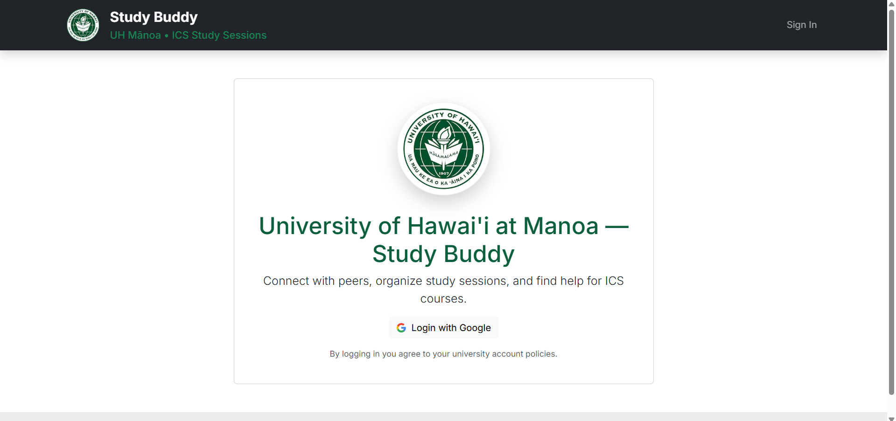
*The initial landing page where users can sign in with their UH Google account.*

### Registration and Sign In
New users register with their UH email. Existing users sign in.

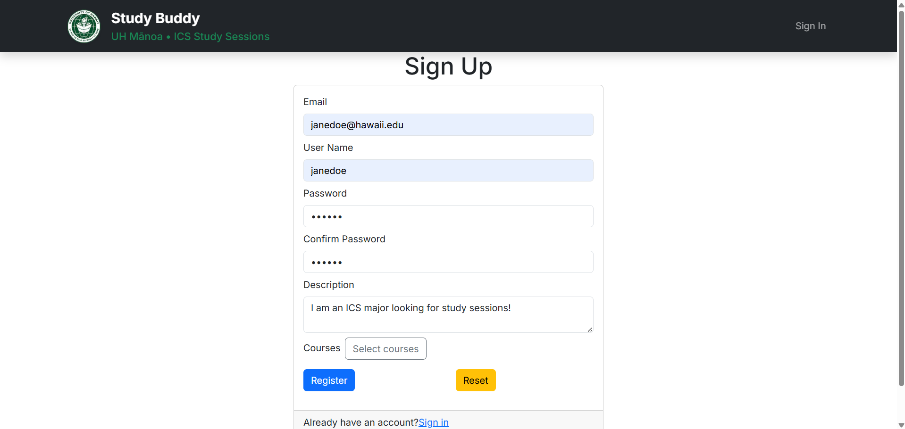
*Registration page for new users.*

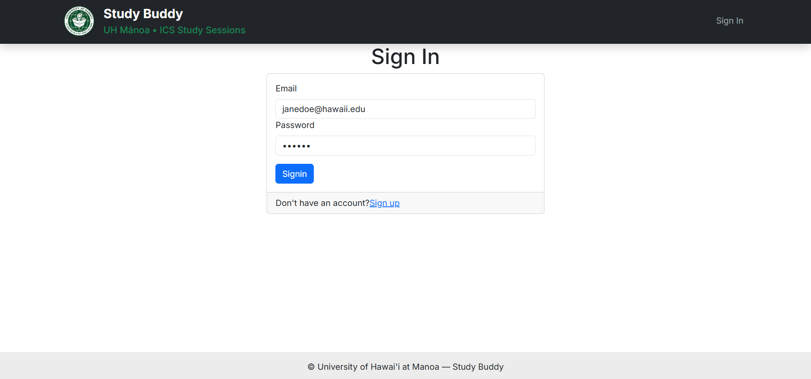
*Sign-in page using @hawaii.edu domain.*

### Home Page (After Login)
After logging in, users see their personalized home page with quick links to profile, sessions, courses, and calendar.


*User's home page after successful login, showing available actions.*

### Profile Management
Users set up or edit their profile, including adding courses they can help with (sensei) or need help with (grasshopper), and uploading a photo for easy identification.

- Navigate to Profile > Edit Profile.
- Add/remove courses and update personal information.

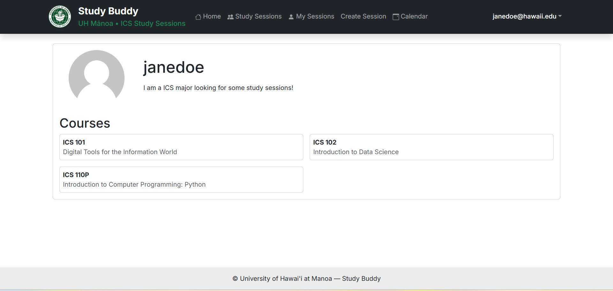
*Main Profile Page*

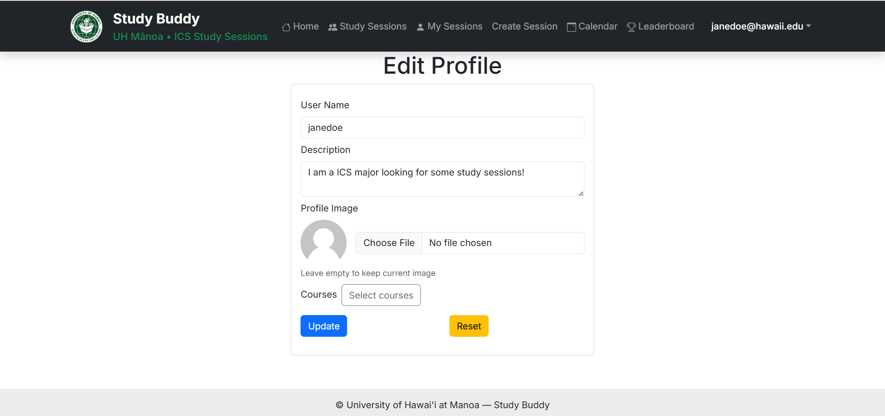
*Edit profile page, changing any courses*

### Creating and Managing Study Sessions
Users can create, edit, join, or view their own sessions.

- **Create a Session**: Go to Create Sessions, Specify topic, course, date/time, and details.

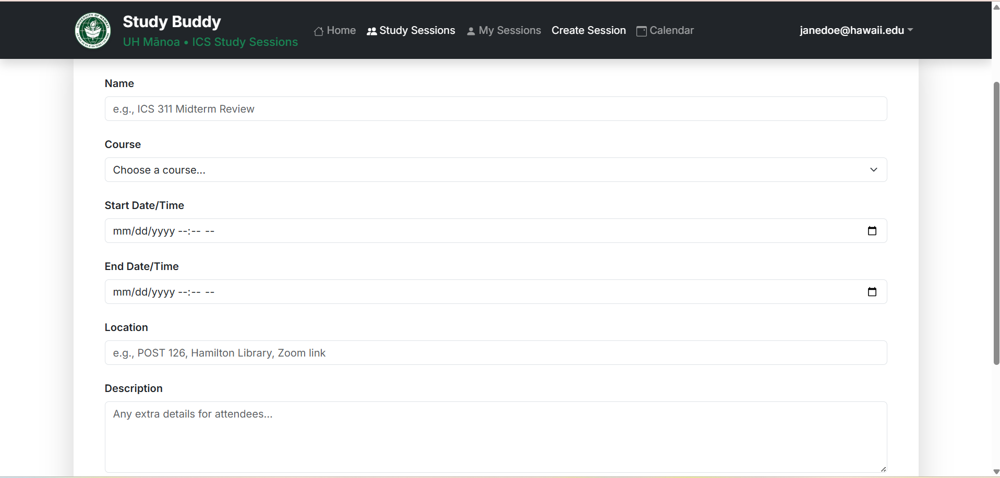

- **My Sessions**: View and manage sessions you've created or joined.

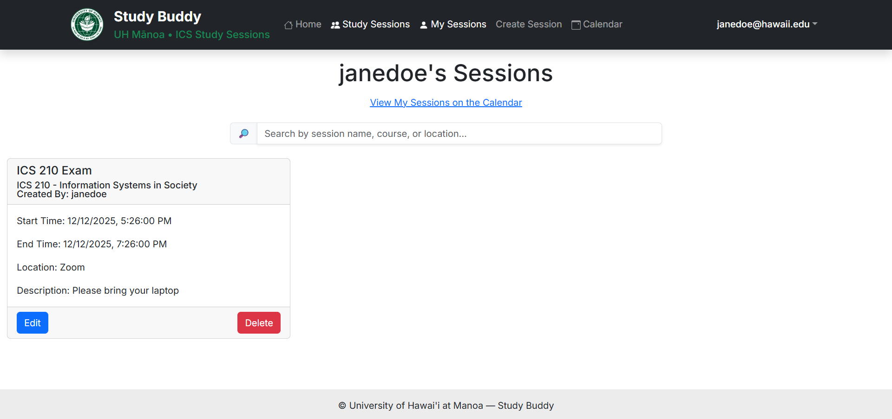

- **All Sessions**: Browse and RSVP to available sessions.

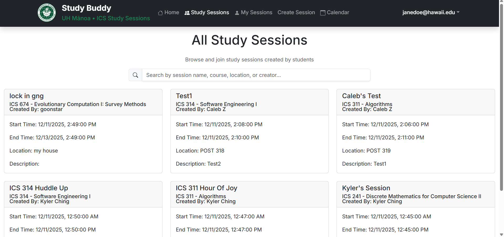

### Calendar View
View all upcoming study sessions in a calendar format.

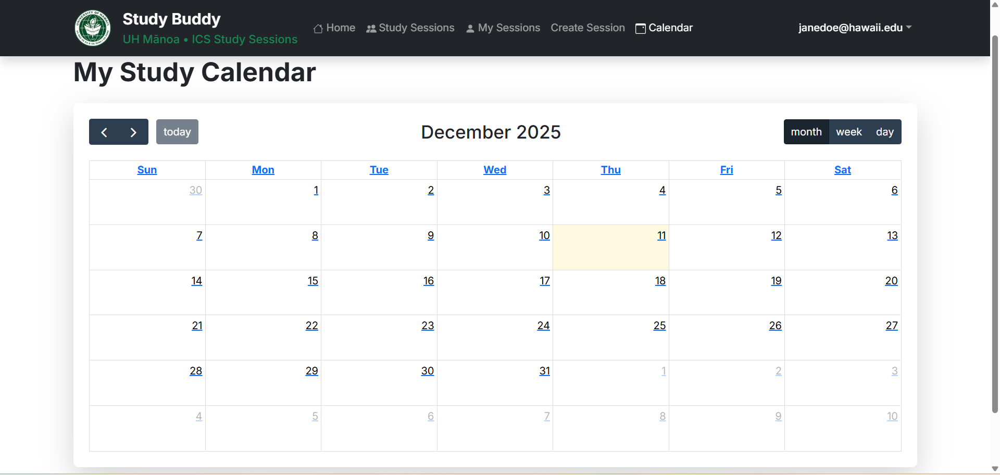

### Other Pages

- Change Password: Securely update your password.
  
  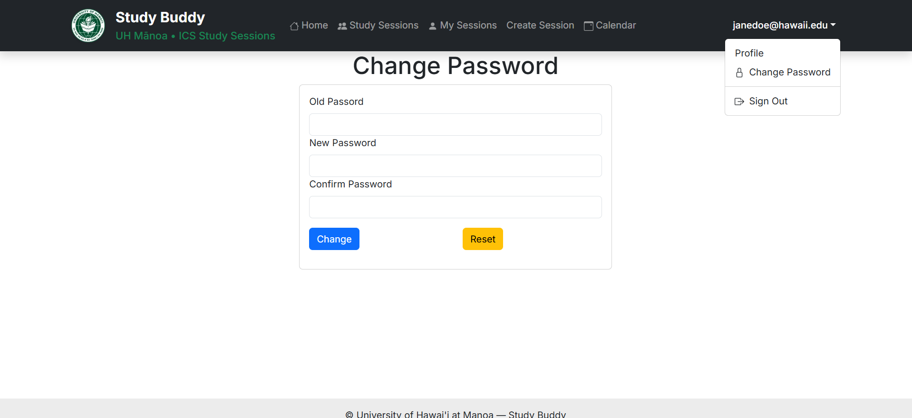
  *Page for updating your password.*

- Sign Out: Safely log out of the application.
  
  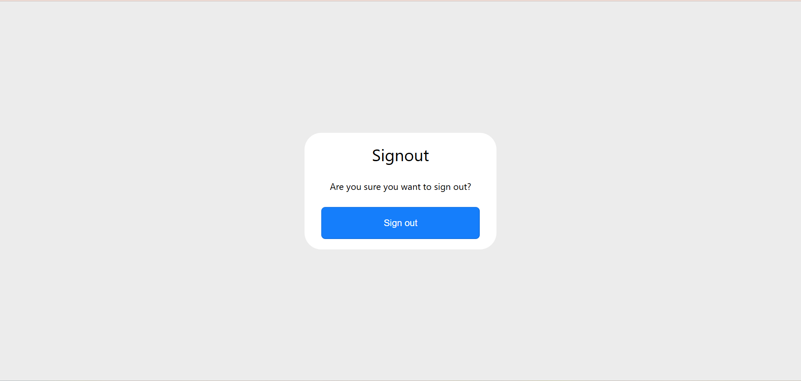
  *Confirmation page for signing out.*

### Admin Features

Administrators have additional privileges to oversee and maintain the platform:

- **Create Sessions on Behalf of Users**: Admins can create study sessions for any user, regardless of who is logged in. This is useful for testing, moderation, or assisting users who need help setting up sessions.

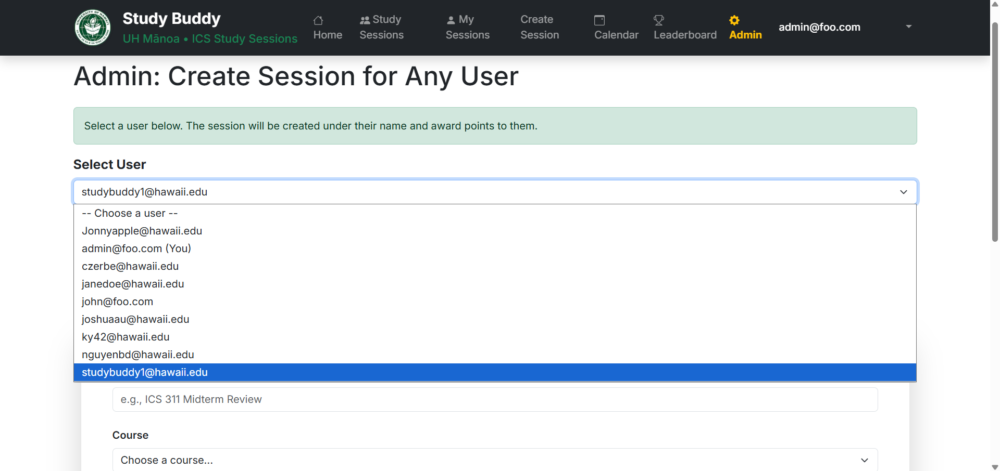

- **Manage and Delete Sessions**: Admins can view, edit, or delete (drop) any study session created by any user, ensuring inappropriate or outdated sessions can be removed promptly.

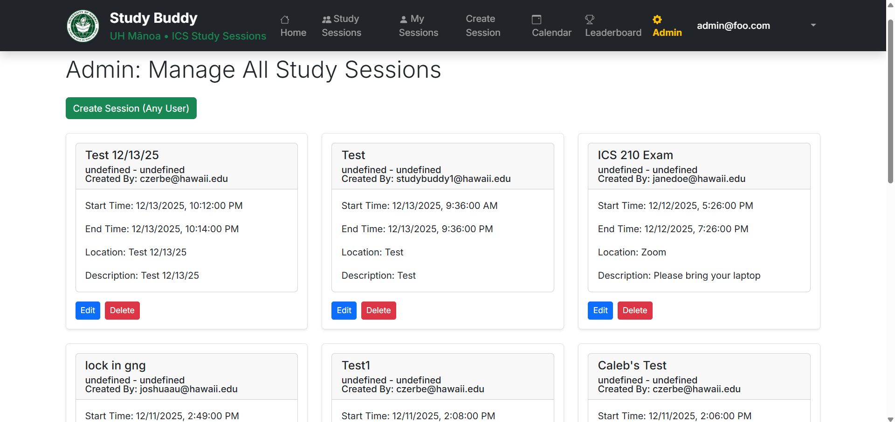

These tools help maintain a safe and functional environment for all users.

### Game Mechanics
To motivate participation, Study Buddy incorporates points, levels, or leaderboards.
Admins may also distribute gift cards or rewards to top-performing students.
The challenge is to design the reward system to prevent abuse or “gaming” the system.

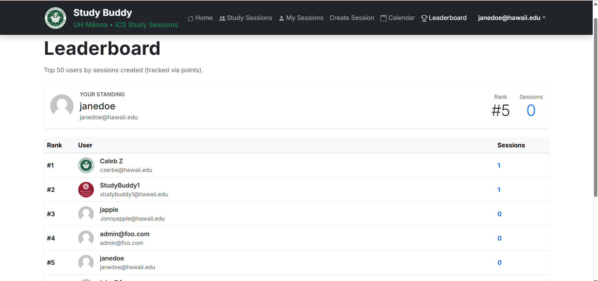

Admins oversee behavior and handle reports of inappropriate use.

## Guest View

If not logged in, most pages redirect to sign-in. No guest browsing of user data is allowed for privacy.


---

## Developer Guide

This guide helps developers set up, run, and contribute to Study Buddy.

### Prerequisites
- Git
- Node.js (v18+) and npm
- PostgreSQL database
- Google OAuth credentials

### Design Goals
- Support login, profile management, and study session scheduling.
- Display course rosters with sensei/grasshopper roles.
- Maintain a calendar view of all upcoming sessions.
- Implement admin monitoring and gamification systems.

### Technology Stack
- Bootstrap + React for the web application.
- Nextjs as the React framework.
- Typescript for backend and frontend.
- ESLint and Prettier for code standardization. 
- PostgreSQL for object-relational mapping.
- Google Calendar API for the session calendar UI.
- Slack integration for notifications.

### Key Collections
- **Profiles** — User info, photo, courses (sensei/grasshopper).
- **Courses** — List of ICS courses.
- **Sessions** — Study sessions (topic, date/time, attendees).
- **Points** — Gamification tracking (reputation, levels, rewards).

### 1. Getting the Source Code
```bash
git clone https://github.com/Study-Buddy-G2S6/study-buddy.git
cd study-buddy
```
### 2. Installation & Configuration
```bash
npm install
```
### 3. Database Setup
```bash
npx prisma migrate dev
npx prisma db seed   # optional, for initial data
```
### 4. Run Locally
```bash
npm run dev
```
### 5. Running Tests
```bash
npx playwright test
```
### 6. Making Changes
- Pages: src/app/
- Components: src/components/
- API routes: src/app/api/
- Database schema: prisma/schema.prisma (run migrations after changes)

Always lint before committing:
```bash
npm run lint
```
---

## Development History

Study Buddy was developed using Issue Driven Project Management (IDPM). Tasks were implemented as GitHub Issues, assigned to individual developers, and tracked via Project Boards. Each task was completed on a branch named issue-XX, then merged to main after review.
Development was organized into three milestones:

- <a href="https://github.com/orgs/Study-Buddy-G2S6/projects/1">Milestone 1</a> : Initial setup, authentication, basic pages


- <a href="https://github.com/orgs/Study-Buddy-G2S6/projects/2">Milestone 2</a>: Profile management, session creation, course integration


- <a href="https://github.com/orgs/Study-Buddy-G2S6/projects/2">Milestone 3</a>: Calendar, polish, testing, deployment

---

## Community Feedback

We deployed the application and gathered feedback from several fellow UHM ICS students through hands-on testing.

**UI and Ease of Use**  
Testers found the site visually appealing and easy to navigate, noting that moving from page to page felt straightforward and intuitive.

**Opportunities for Improvement**  
The primary issue reported was that some links were not working properly. Testers suggested fixing these navigation issues to improve the overall experience.

**App Performance**  
No major performance concerns were mentioned; the application loaded and responded smoothly during testing.

**Bugs and Anomalies**  
Beyond the broken links, no significant bugs were reported.

Overall, feedback was generally positive regarding the look and ease of use, with the main constructive criticism focused on resolving the non-functional links.

---

## Contact-us

- For questions or feedback, reach out via GitHub Issues on the repository or contact individual team members through their personal pages.
Thank you for visiting Study Buddy!

## Contribution
- Create a branch, make changes, test locally, and submit a pull request referencing the relevant issue.